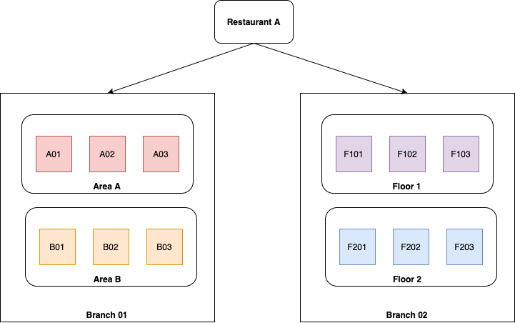
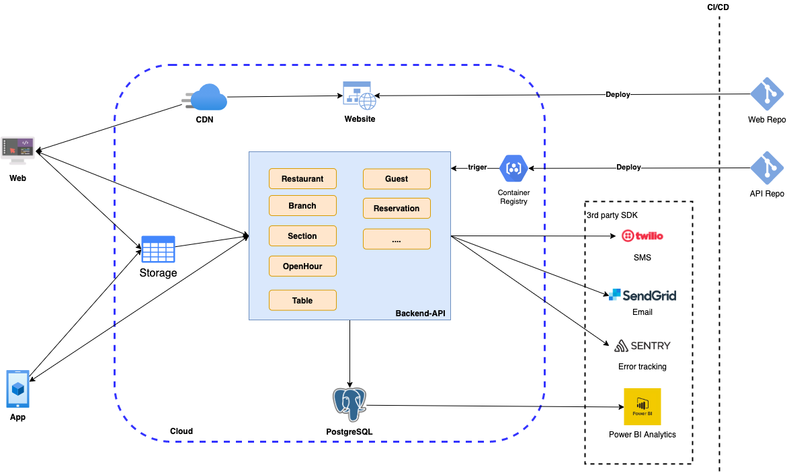
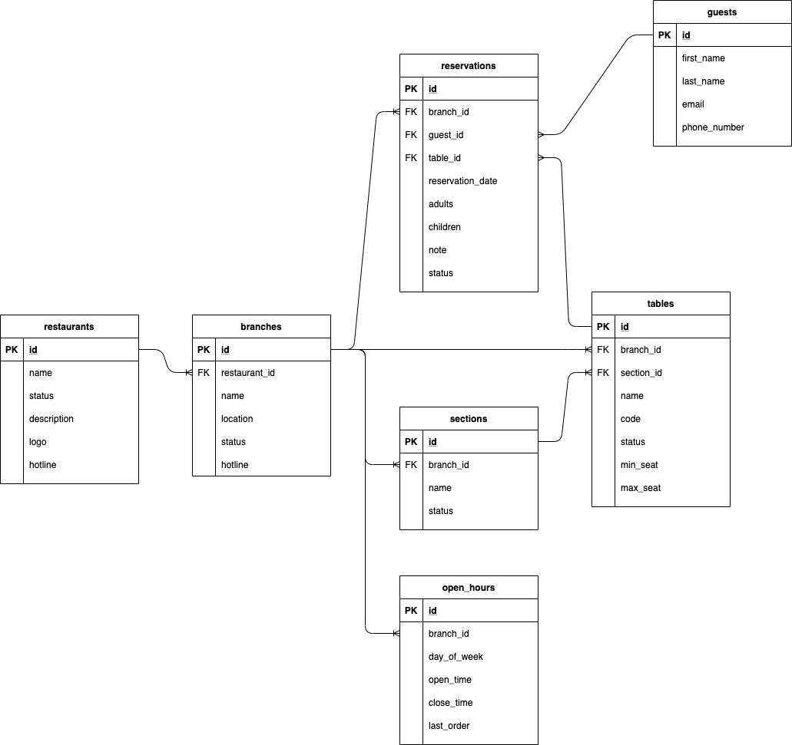
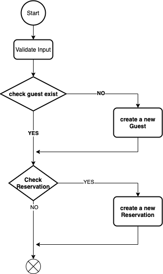

### Goal

Implement a database design and architecture of a restaurant booking system for web and mobile.

### Assumption & Scope
- Neet to manage a restaurant
- A restaurant have many branchs with different location
- Need to manage open hour of a branch
- Need to manage table of a branch
- Need to manage reservations
- Need to manage guests
- Analytics

**Example**:
- Restaurant A, have two branchs: *branch 01* & *branch 02*
- Branch 01, have two sections:
    - Area A have 3 tables: A01, A02, A03
    - Area B have 3 tables: B01, B02, B03
- Branch 02, have two sections:
    - Floor 1 have 3 tables: F101, F102, F103
    - Floor 2 have 3 tables: F201, F202, F203



### Architecture



### Database Schema



### Flow create a new reservation



### How to run application
- Config file `.env`
``` bash
#Config app
NODE_ENV=local
PORT=4000
DEBUG_LOG=1

# Database
SQL_HOST=localhost
SQL_DATABASE=postgres
SQL_USERNAME=postgres
SQL_PASSWORD=password
```

- Install packages: `npm install`
- Start Database: `make startDB` or `docker-compose -f docker-compose.yml up -d --build postgres`
- Run application: `npm run start`

### API
- Get a restaurant info

Request:
``` bash
curl -H "Content-Type: application/json" http://localhost:4000/api/restaurant/1
```

Response:
```json
{
  "status": "SUCCESS",
  "message": "Okie",
  "data": {
    "id": 1,
    "name": "Demo Restaurant",
    "desciption": "non enim praesent elementum facilisis leo vel fringilla est ullamcorper",
    "logo": "logo",
    "hotline": "hotline",
    "status": "active",
    "createdAt": "2020-10-12T06:30:25.484Z",
    "updatedAt": "2020-10-12T06:30:25.484Z"
  }
}
```
- Get a branch info

Request:
``` bash
curl -H "Content-Type: application/json" http://localhost:4000/api/branch/1
```
Response:
```json
{
  "status": "SUCCESS",
  "message": "Okie",
  "data": {
    "id": 1,
    "restaurant_id": 1,
    "name": "Branch 01",
    "location": "localtion 01",
    "status": "active",
    "hotline": "hotline branch 01",
    "createdAt": "2020-10-12T06:30:25.501Z",
    "updatedAt": "2020-10-12T06:30:25.501Z"
  }
}
```
- Get list branchs of a restaurant

Request:
``` bash
curl -H "Content-Type: application/json" http://localhost:4000/api/branch/restaurant/1
```
Response:
```json
{
  "status": "SUCCESS",
  "message": "Okie",
  "data": [
    {
      "id": 1,
      "restaurant_id": 1,
      "name": "Branch 01",
      "location": "localtion 01",
      "status": "active",
      "hotline": "hotline branch 01",
      "createdAt": "2020-10-12T06:30:25.501Z",
      "updatedAt": "2020-10-12T06:30:25.501Z"
    },
    {
      "id": 2,
      "restaurant_id": 1,
      "name": "Branch 02",
      "location": "localtion 02",
      "status": "active",
      "hotline": "hotline branch 02",
      "createdAt": "2020-10-12T06:30:25.501Z",
      "updatedAt": "2020-10-12T06:30:25.501Z"
    }
  ]
}
```
- Get list open hours of a branch
Request:
``` bash
curl -H "Content-Type: application/json" http://localhost:4000/api/openhour/branch/1
```
Response:
```json
{
  "status": "SUCCESS",
  "message": "Okie",
  "data": [
    {
      "id": 1,
      "branch_id": 1,
      "day_of_week": 0,
      "open_time": 600,
      "close_time": 1380,
      "last_order": 1140,
      "createdAt": "2020-10-12T06:30:25.512Z",
      "updatedAt": "2020-10-12T06:30:25.512Z"
    },
    {
      "id": 2,
      "branch_id": 1,
      "day_of_week": 1,
      "open_time": 600,
      "close_time": 1380,
      "last_order": 1140,
      "createdAt": "2020-10-12T06:30:25.512Z",
      "updatedAt": "2020-10-12T06:30:25.512Z"
    },
    {
      "id": 3,
      "branch_id": 1,
      "day_of_week": 2,
      "open_time": 600,
      "close_time": 1380,
      "last_order": 1140,
      "createdAt": "2020-10-12T06:30:25.512Z",
      "updatedAt": "2020-10-12T06:30:25.512Z"
    },
    {
      "id": 4,
      "branch_id": 1,
      "day_of_week": 3,
      "open_time": 600,
      "close_time": 1380,
      "last_order": 1140,
      "createdAt": "2020-10-12T06:30:25.512Z",
      "updatedAt": "2020-10-12T06:30:25.512Z"
    },
    {
      "id": 5,
      "branch_id": 1,
      "day_of_week": 4,
      "open_time": 600,
      "close_time": 1380,
      "last_order": 1140,
      "createdAt": "2020-10-12T06:30:25.512Z",
      "updatedAt": "2020-10-12T06:30:25.512Z"
    },
    {
      "id": 6,
      "branch_id": 1,
      "day_of_week": 5,
      "open_time": 600,
      "close_time": 1380,
      "last_order": 1140,
      "createdAt": "2020-10-12T06:30:25.512Z",
      "updatedAt": "2020-10-12T06:30:25.512Z"
    },
    {
      "id": 7,
      "branch_id": 1,
      "day_of_week": 6,
      "open_time": 600,
      "close_time": 1380,
      "last_order": 1140,
      "createdAt": "2020-10-12T06:30:25.512Z",
      "updatedAt": "2020-10-12T06:30:25.512Z"
    }
  ]
}
```


## Author
chuongtrh@gmail.com | [Github](https://github.com/chuongtrh)
